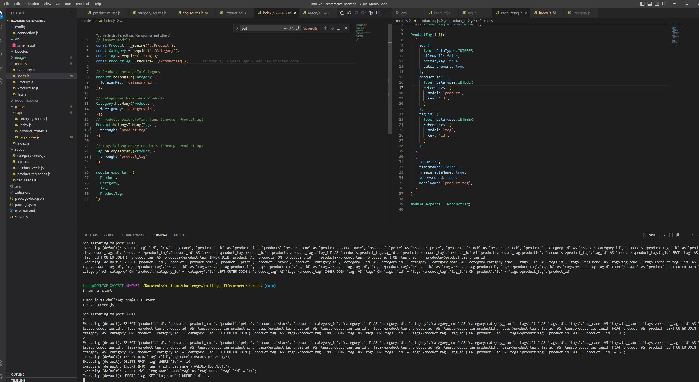
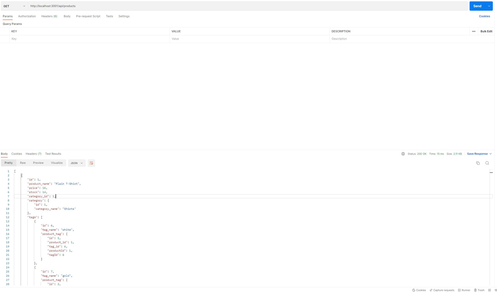
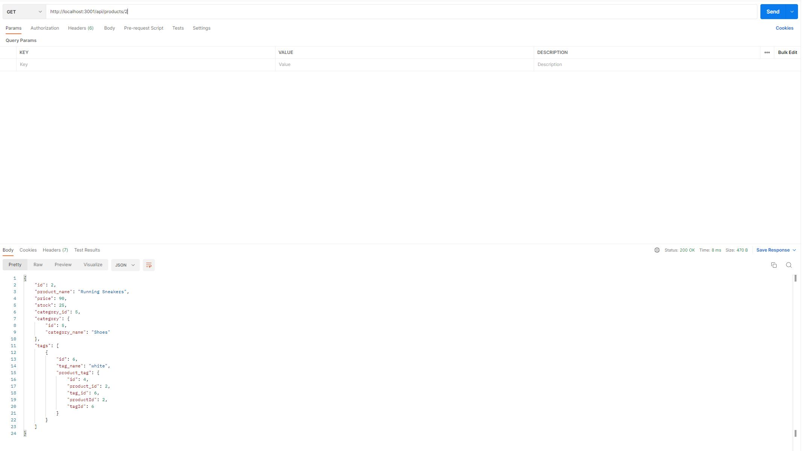
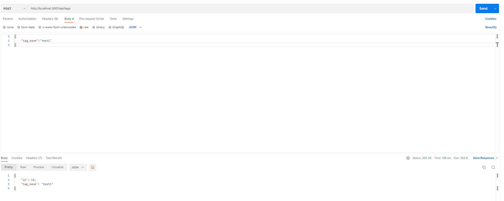
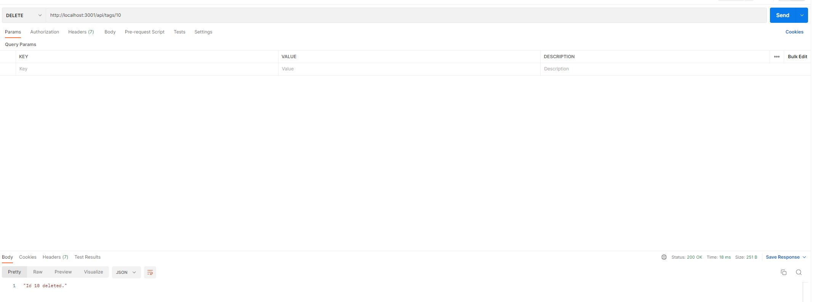
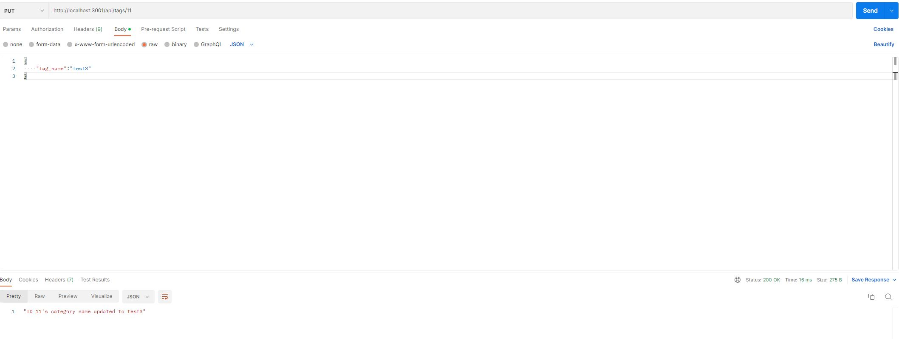

# E-Commerce Backend

## Description
E-commerce backend that allows you to perform CRUD operations on the database.

Github Link: https://github.com/lunchtimewhee/ecommerce-backend
Video: https://app.castify.com/watch/b1577f70-b85b-463a-8e1c-f91fda61f8ce

## Installation Instructions
1. Clone from https://github.com/lunchtimewhee/ecommerce-backend

2. Start server via "npm run start" in CLI

## Table of Contents
 - [E-Commerce Backend](#e-commerce-backend)
 - [Description](#description)
 - [Installation Instructions](#installation-instructions)
 - [Usage Information](#usage-information)
 - [License](#license)
 - [Contribution Guidelines](#contribution-guidelines)
 - [Testing Instructions](#testing-instructions)
 - [Questions?](#questions)

## Questions?
- Github: https://github.com/lunchtimewhee 
- Email: anthonyrli1994@gmail.com

## Usage Information
In Postman or Insomnia, you can utilize the CRUD operations on all models.

1. Get all:

2. Get one:

2. Post new:

2. Delete one:

2. Put (modify) one:

## Testing Instructions
N/A

## License

## Contribution Guidelines
Please reach out to Anthony li at the given contacts:

